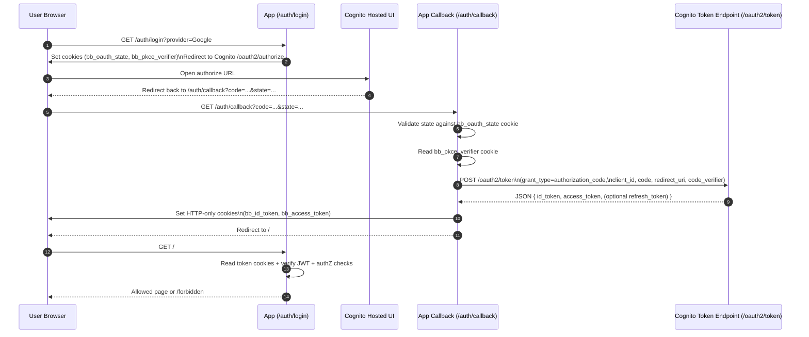

```mermaid
sequenceDiagram
    autonumber
    participant U as User Browser
    participant A as App (/auth/login)
    participant C as Cognito Hosted UI
    participant CB as App Callback (/auth/callback)
    participant T as Cognito Token Endpoint (/oauth2/token)

    U->>A: GET /auth/login?provider=Google
    A->>U: Set cookies (bb_oauth_state, bb_pkce_verifier)\nRedirect to Cognito /oauth2/authorize
    U->>C: Open authorize URL
    C-->>U: Redirect back to /auth/callback?code=...&state=...
    U->>CB: GET /auth/callback?code=...&state=...

    CB->>CB: Validate state against bb_oauth_state cookie
    CB->>CB: Read bb_pkce_verifier cookie
    CB->>T: POST /oauth2/token\n(grant_type=authorization_code,\nclient_id, code, redirect_uri, code_verifier)
    T-->>CB: JSON { id_token, access_token, (optional refresh_token) }

    CB->>U: Set HTTP-only cookies\n(bb_id_token, bb_access_token)
    CB-->>U: Redirect to /
    U->>A: GET /
    A->>A: Read token cookies + verify JWT + authZ checks
    A-->>U: Allowed page or /forbidden
```